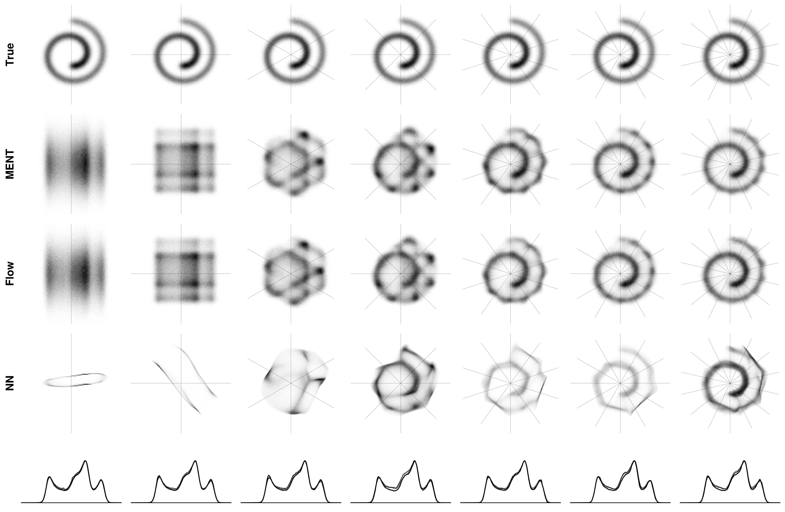

# MENT-Flow

Approximate maximum-entropy tomography (MENT) using normalizing flows. Corresponding paper: https://doi.org/10.1103/PhysRevResearch.6.033163.




## Installation

```
git clone https://github.com/austin-hoover/ment-flow.git
cd ment-flow
pip install -e .
```


## Experiments

Install additional dependencies:

```
pip install -e '.[test]'
```

Experiments use [hydra](https://hydra.cc). Config files can be found in `/experiments/config`. Parameters can be overridden with command line arguments. For example: 
```
cd experiments/rec_2d/linear
python train_flow.py device=mps dist.name=swissroll meas.num=7
```
Results are stored in `./outputs/{script_name}/{timestamp}/` directory created in the working directory. Runtime parameters are stored in `./outputs/{script_name}/{timestamp}/config/`.
